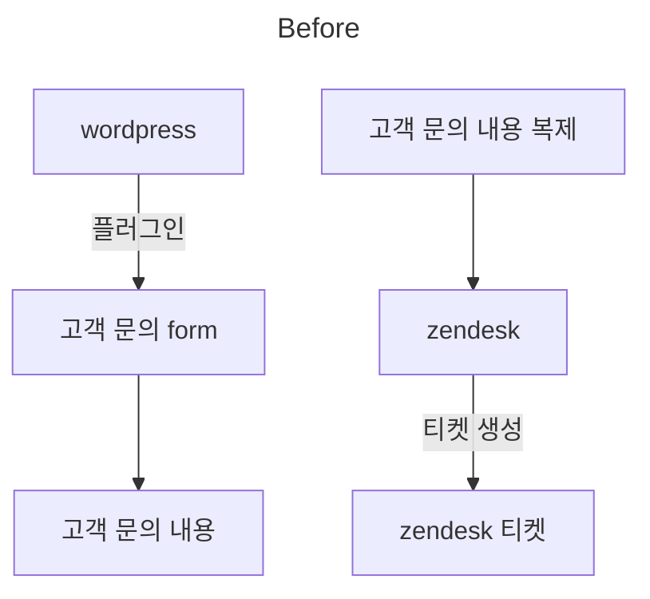
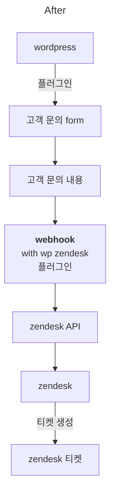

**Wordpress** 는 전 세계 콘텐츠 관리 시스템 (CMS) 시장의 64% 점유, 그리고 전체 웹페이지 시장으로 보면 43%를 점유하고 있는 전 세계에서 가장 많이 사용되고 있는 웹 혹은 CMS 시스템입니다. 고객은 워드프레스 기반의 랜딩페이지를 운영하고 있었고, 고객 문의 form 을 통해 방문자 고객을 리드 고객으로 전환하고 있었는데요.

**Zendesk**는 전 세계 고객 경험 솔루션 쪽에서 18% 정도의 시장 점유율을 보이고 있습니다. 수치상으로 보면 높지 않아보이지만, 매출 관점에서 봤을 때 엔터프라이즈 급 기업들의 대부분이 Zendesk를 사용하는 것을 볼 수 있는데요. 가장 많이 알려져있는 티켓 기반의 고객 응대 시스템 솔루션으로 보면 되겠습니다. 고객은 Zendesk를 이용하여 잠재 고객, 리드 고객들의 문의를 응대하고 있었습니다.

## 고객 문제

문제는 Wordpress form을 통해 받은 고객 문의 데이터 내용을, 다시 직원분께서 Zendesk 티켓에 옮겨주어야 한다는 점이었습니다. 이는 사람이 일일이 해주어야 하는 수동적이고 반복적인 프로세스였습니다. 중간에 누락이나 실수로 부정확한 데이터로 옮겨질 수도 있구요.

## 고객 의뢰 사항

wordpress form 에서 고객 문의 사항이 제출되면, zendesk 시스템으로 고객 문의사항 데이터가 자동으로 연동되어 zendesk 티켓이 생성되도록 요청해주셨습니다.

## 솔루션

위와 같이 wordpress 와 zendesk 시스템 연동을 하였습니다. 이를 통해 고객 wordpress 에서 수집되는 고객 문의는 zendesk 티켓 관리 시스템에서 종합적으로 관리 대응할 수 있게 되었습니다.

구체적인 프로세스는 다음과 같습니다.

wordpress form plugin 종류가 많은데요. 그 중에서 zendesk API 쪽에서 받을 수 있는 (필드 맵핑이 되는) 플러그인 선택이 필요했습니다. 물론, 중간에 서버리스 혹은 aumation (e.g. Zapier)등을 통해 필드 맵핑을 수동으로 해 줄 수도 있었지만, 이후 장기적으로 고객의 관리 포인트를 늘리는 것은 좋지 않다고 판단했습니다. **자동화 업무 의뢰는, 유지 운영을 위한 관리 비용과 복잡도를 최대한 낮추어야만, 이후 고객이 현실적으로 운영하기에 용이하기 때문**입니다.

<figure>

<figcaption>매뉴얼 산출물 예시</figcaption>
</figure>

:::note
쿠스랩 서비스는, 문제를 해결해 드릴 뿐 아니라, 문제가 어떻게 해결되었는지, 향후 유지 운영 관리는 어떻게 해야하는지 상세한 매뉴얼 산출물을 함께 제공해 드립니다.
:::

:::info
조직 내 시스템, 데이터 통합 및 연동의 문제를 가지고 계신가요?
[**Kooslab 서비스 문의하기**](https://tally.so/r/mO5N4K)
:::
